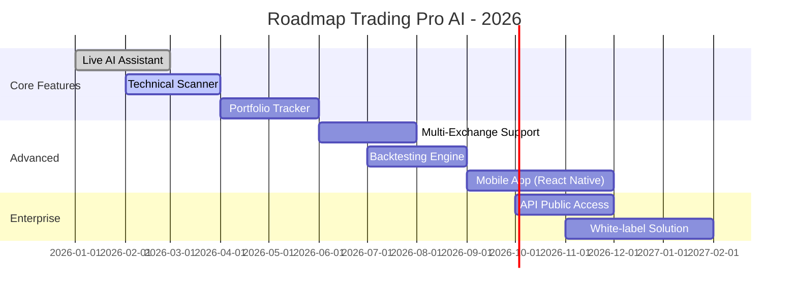

```markdown
<div align="center">
  
</div>

# Trading Pro AI

<p align="center">
  <strong>Platform trading crypto berbasis AI profesional untuk analisis pasar mendalam, prediksi harga akurat, dan rekomendasi trading cerdas.</strong>
</p>

<p align="center">
  <a href="#-fitur-utama">Fitur</a> •
  <a href="#-tech-stack">Tech Stack</a> •
  <a href="#-run-locally">Run Locally</a> •
  <a href="#-roadmap">Roadmap</a> •
  <a href="#-contributing">Contributing</a> •
  <a href="#-license">License</a>
</p>

---

## ✨ Fitur Utama

| Fitur | Deskripsi | Manfaat |
|-------|-----------|---------|
| 🎙️ **Live AI Assistant** | Interaksi suara real-time dengan AI RIZBOT | Trading hands-free, respons lebih cepat |
| 📊 **Technical Analysis Scanner** | MACD, RSI, Volume, Candlestick Patterns, Support/Resistance | Identifikasi peluang trading secara otomatis |
| 💼 **Portfolio Tracker** | Monitoring aset real-time dengan visualisasi intuitif | Kontrol penuh atas performa portofolio |
| 🔔 **Smart Price Alerts** | Notifikasi berbasis kondisi pasar kustom | Tidak ketinggalan momen entry/exit penting |
| 📋 **Watchlist Management** | Kelola daftar pantauan dengan filter & kustomisasi | Fokus pada aset yang paling relevan |
| 🧠 **News Sentiment Analysis** | Analisis sentimen berita crypto secara real-time | Decision making berbasis data fundamental |

---

## 💻 Tech Stack

```
Frontend:
├── React 18 + TypeScript
├── Next.js 14 (App Router)
├── Tailwind CSS + Shadcn/UI
├── Zustand (State Management)

Backend & AI:
├── Node.js + Express
├── Google Gemini API (LLM)
├── WebSocket (Real-time Communication)
├── Redis (Caching & Rate Limiting)

Data & Infrastructure:
├── PostgreSQL (User Data)
├── TimescaleDB (Market Data Time-series)
├── Docker + Docker Compose
├── Vercel / AWS (Deployment)
```

---

## 🚀 Run Locally

**Prerequisites:** 
- Node.js ≥ 18.x
- npm ≥ 9.x atau pnpm ≥ 8.x
- API Key Gemini dari [Google AI Studio](https://aistudio.google.com/)

### Langkah Instalasi:

1. **Clone repository:**
   ```bash
   git clone https://github.com/your-username/trading-pro-ai.git
   cd trading-pro-ai
   ```

2. **Install dependencies:**
   ```bash
   npm install
   # atau
   pnpm install
   ```

3. **Konfigurasi environment variables:**
   Salin file contoh dan isi dengan kredensial Anda:
   ```bash
   cp .env.local.example .env.local
   ```
   
   Edit `.env.local`:
   ```env
   GEMINI_API_KEY=your_gemini_api_key_here
   DATABASE_URL=your_database_url
   REDIS_URL=your_redis_url
   ```

4. **Jalankan aplikasi:**
   ```bash
   # Development mode
   npm run dev

   # Production build
   npm run build
   npm run start
   ```

5. **Akses aplikasi:**
   Buka [http://localhost:3000](http://localhost:3000) di browser Anda.

> 💡 **Tips Profesional**: Gunakan `npm run lint` dan `npm run type-check` sebelum commit untuk menjaga kualitas kode.

---

## 🗺️ Roadmap



### ✅ Completed
- [x] Integrasi Gemini API untuk AI Assistant
- [x] Real-time price feed dengan WebSocket
- [x] UI/UX responsive dengan dark mode

### 🔄 In Progress
- [ ] Optimasi latency AI response < 500ms
- [ ] Implementasi multi-language support
- [ ] Unit & E2E testing coverage > 80%

### 📅 Planned
- [ ] Integrasi exchange tambahan (Bybit, OKX, KuCoin)
- [ ] Fitur copy trading & social sentiment
- [ ] Dashboard analytics untuk institutional users

---

## 🤝 Contributing

Kami sangat menyambut kontribusi dari komunitas! Berikut panduan untuk berkontribusi:

### Langkah Kontribusi:
1. **Fork repository** ini
2. **Buat branch fitur** baru:
   ```bash
   git checkout -b feat/nama-fitur-anda
   # atau
   git checkout -b fix/nama-bug-yang-diperbaiki
   ```
3. **Commit perubahan** dengan pesan yang deskriptif:
   ```bash
   git commit -m "feat: tambah indikator Bollinger Bands pada scanner"
   ```
4. **Push ke branch** Anda:
   ```bash
   git push origin feat/nama-fitur-anda
   ```
5. **Buka Pull Request** ke branch `main` repository ini

### Guidelines:
- ✅ Ikuti [Conventional Commits](https://www.conventionalcommits.org/)
- ✅ Pastikan semua test lulus: `npm run test`
- ✅ Tambahkan dokumentasi untuk fitur baru
- ✅ Gunakan TypeScript strict mode
- ✅ Review kode minimal 1 maintainer sebelum merge

### Butuh Bantuan?
- 📚 Baca [CONTRIBUTING.md](./CONTRIBUTING.md) untuk panduan detail
- 💬 Diskusi di [GitHub Discussions](https://github.com/your-username/trading-pro-ai/discussions)
- 🐞 Laporkan bug di [Issues](https://github.com/your-username/trading-pro-ai/issues)

---

## 📄 License

Distributed under the **MIT License**. See [`LICENSE`](./LICENSE) for more information.

<details>
<summary>Klik untuk melihat isi LICENSE</summary>

```
MIT License

Copyright (c) 2026 Bodong AI Agency

Permission is hereby granted, free of charge, to any person obtaining a copy
of this software and associated documentation files (the "Software"), to deal
in the Software without restriction, including without limitation the rights
to use, copy, modify, merge, publish, distribute, sublicense, and/or sell
copies of the Software, and to permit persons to whom the Software is
furnished to do so, subject to the following conditions:

The above copyright notice and this permission notice shall be included in all
copies or substantial portions of the Software.

THE SOFTWARE IS PROVIDED "AS IS", WITHOUT WARRANTY OF ANY KIND, EXPRESS OR
IMPLIED, INCLUDING BUT NOT LIMITED TO THE WARRANTIES OF MERCHANTABILITY,
FITNESS FOR A PARTICULAR PURPOSE AND NONINFRINGEMENT. IN NO EVENT SHALL THE
AUTHORS OR COPYRIGHT HOLDERS BE LIABLE FOR ANY CLAIM, DAMAGES OR OTHER
LIABILITY, WHETHER IN AN ACTION OF CONTRACT, TORT OR OTHERWISE, ARISING FROM,
OUT OF OR IN CONNECTION WITH THE SOFTWARE OR THE USE OR OTHER DEALINGS IN THE
SOFTWARE.
```
</details>

> ⚠️ **Disclaimer**: Aplikasi ini adalah alat bantu analisis. Trading crypto memiliki risiko tinggi. Selalu lakukan riset mandiri (DYOR) dan jangan menginvestasikan dana yang tidak siap Anda rugikan.

---

## 📬 Contact & Support

<div align="center">

[🌐 Website](https://bodong.ai) • 
[💬 Discord Community](https://discord.gg/your-invite) • 
[🐦 Twitter/X](https://twitter.com/bodongai) • 
[📧 Email Support](mailto:support@bodong.ai)

</div>

<p align="center">
  <sub>Dibangun dengan ❤️ oleh <a href="https://bodong.ai"><strong>Bodong AI Agency</strong></a> — Memberdayakan trader dengan kecerdasan buatan.</sub>
</p>

<p align="center">
  <a href="#trading-pro-ai">⬆️ Back to Top</a>
</p>
```

✅ **Siap copas!** 

🔧 **Jangan lupa ganti placeholder berikut dengan data aktual Anda:**
- `your-username` → username GitHub Anda
- `your_gemini_api_key_here` → API key Gemini Anda
- `https://github.com/your-username/trading-pro-ai.git` → URL repo Anda
- `https://discord.gg/your-invite` → link Discord komunitas
- URL kontak lainnya sesuai kebutuhan

Butuh versi lebih singkat atau tambahan section lain? Tinggal bilang! 🚀
